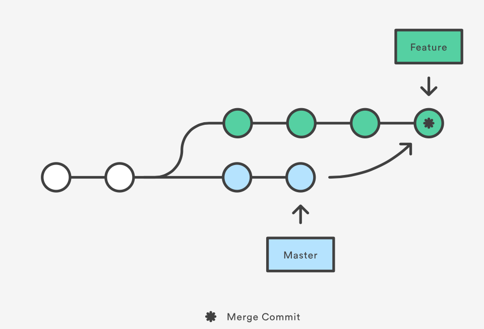
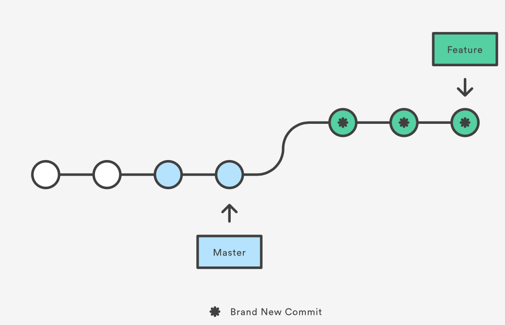

# Tutorial de Git

## Sumário

- [Git init](#init)
- [Git remote](#remote)
- [Git clone](#clone)
- [Git config](#config)
- [Git add](#add)
- [Git commit](#commit)
- [Git stash](#stash)
- [Git log](#log)
- [Git status](#status)
- [Git checkout](#checkout)
- [Git branch](#branch)
- [Git clean](#clean)
- [Git reset](#reset)
- [Git revert](#revert)
- [Git merge](#merge)
- [Git rebase](#rebase)
	- [squash e fixup](#squash) 
- [Git fetch](#fetch)
- [Git pull](#pull)
- [Git push](#push)
- [Referências](#referencias)

<a name="init"></a>
## Git init

Cria novo repositório git na pasta atual

<a name="remote"></a>
## Git remote

Vincula um repositório remoto com o repositório local. Normalmente, o nome utilizado é "origin". Pode adicionar mais de um repositório remoto.

```bash
# adiciona repositório remoto
git remote add <remote_name> <remote_repo_url>
# renomeia repositório remoto
git remote rename <old_name> <new_name>
# remove repositório remoto
git remote remove <name>
```

<a name="clone"></a>
## Git clone

Inicializa e configura um repositório git a partir de um repositório remoto.

<a name="config"></a>
## Git config

```bash
# configura o usuário para todos os repositórios git
# usar --local para o repositório atual apenas
git config --global user.name <name>
git config --global user.email <email>
# cria alias para comando git no repositório atual
git config --global alias.<alias-name> <git-command>
```

<a name="add"></a>
## Git add

Git add adiciona mudanças a serem commitadas. Estas ficam em um estado chamado **"staged"**.

```bash
# adiciona todas as mudanças realizadas no arquivo
git add <file>

# adiciona todas as mudanças realizadas em arquivos que se encontram nesse caminho
git add <path>
```

### -p

Passa mudança por mudança do arquivo perguntando se ela deve ser adicionada.

<a name="commit"></a>
## Git commit

Git commit salva as mudanças realizadas que se encontram em um estado "staged".

```bash
git commit -m "mensagem de commit"
```

### --amend

Adiciona mudanças ao último commit e permite mudar a mensagem de commit. É como se cancelasse o commit anterior e criasse um novo, portanto **NÃO** deve ser feito em commits que foram para branches compartilhadas.

```bash
git commit --amend -m "nova mensagem de commit"
```

<a name="stash"></a>
## Git stash

Salva todas as mudanças não commitadas (staged ou não), exceto arquivos untracked oou ignorados (git ignore).

```bash
# stash simples
git stash
# stash com uma mensagem
git stash save "message"
```

### -u

Essa flag informa o git também fazer o stash de arquivos untracked.

### -a

Essa flag informa o git também fazer o stash de todos os arquivos modificados (incluindo untracked e ignorados)

### -p

Stash parcial. Passa por todos os arquivos perguntando se quer fazer o stash.
Opções:

- **/** : Procura uma modificação através de uma regex
- **?** : help
- **n** : no
- **q** : quit (faz o stash de todos que marcou sim até o momento)
- **s** : divide a mudança (hunk) em hunks menores
- **y** : yes

### list

Mostra todos os stashes realizados.

### pop

Retira as últimas modificações stashed da lista e aplica elas no diretório de trabalaho atual.
Também é possível passar a modificação específica.

```bash
git stash pop
git stash pop stash@{2}
```

### apply

Aplica as últimas modificações stashed no diretório de trabalaho atual, mas não tira elas da pilha.

### drop

Exclui o stash informado

### clear

Exclui todos os stashes

<a name="log"></a>
## Git log

Mostra todos os commits realizados na branch informada. E, por default, utiliza a branch atual.

```bash
git log <branch>
```

### Filtros

```bash
# 10 ultimos commits
git log -10 
# filtrar por data
git log --after yyyy-mm-dd --before yyyy-mm-dd
# por autor
git log --author="ZaneZop"
# Filtra pela mensagem de commit
git log --grep="HOT-"
```

<a name="status"></a>
## Git status

Mostra o estado do diretório de trabalho e da "staging area"

<a name="checkout"></a>
## Git checkout

Comando utilizado para voltar a commit anteriores ou mudar de branch.

**Exemplos:**

```bash
git checkout <commit>
```
> Muda a **HEAD** para o commit informado. Se este for um commit antigo, resulta em "detached HEAD", ou seja, a cabeça (ponteiro para o commit atual) não se encontra no último commit da branch atual.
> Qualquer commit realizado nesse estado será órfão e será descartado pelo garbage collector em algum momento.

```bash
git checkout <branch>
```
> Muda a **HEAD** para a branch informada e no commit mais recente

```bash
git checkout -b <branch>
```
> Cria uma nova branch com o nome informado, a partir do commit atual, e muda para ela

<a name="branch"></a>
## Git branch

```bash
# lista todas as branches
git branch
# Cria uma nova branch com o nome informado
git branch <nome>
```

### -a

Mostra todas as branches remotas conhecidas.

```bash
git branch -a
```

### -D

Deleta a branch informada, mesmo que ela tenha commits que não foram "mergeados". Para evitar isso, pode usar a flag -d no lugar.

### -m

Renomeia a branch.

```bash
git branch -m <new_name>
```

<a name="clean"></a>
## Git clean

Descarta todas as mudanças no diretório de trabalho, ou seja, que não foram staged nem commitadas. Exige que seja forçado para evitar descartar mudanças de forma indesejada.

```bash
# exclui arquivos untracked
git clean -f
# exclui arquivos untracked no caminho especificado
git clean <path> -f
```

### -n

```bash
git clean -n
```

> Mostra tudo que será realizado pelo comando git clean sem fazê-lo de fato.

### -d

Também remove diretórios untracked.

<a name="reset"></a>
## Git reset

Git reset volta para o commit informado, deicando os commits posteriores "órfãos" e estes serão excluídos pelo garbage collector do git em algum momento.

Esse comando **NÃO** deve ser utilizado em uma branch compartilhada por mais de um desenvolvedor, pois irá gerar inconsistências e o git irá interpretar que as branches divergiram, exigindo um merge no futuro.

### --mixed

A flag --mixed é utilizada por padrão com o comando reset. Ela volta ao commit informado e todas as alterações realizadas a partir deste commit continuam presente, mas como **unstaged**. É como se desfizesse todas as operações **git commit** e **git add** realizadas após o commit informado.

**Exemplos:**

```bash
git reset <commit>
```
> Se não for passado um commit, **HEAD** é usado por default.

```bash
git reset <file>
git reset --mixed <file>
```
> Os dois comandos são equivalentes e removem todas as alterações no arquivo informado que estão "staged". Ou seja, desfaz o comando **git add \<file>**.

### --soft

A flag --soft Ela faz com que os commits sejam desfeitos até voltar ao commit informado, mas não muda as operações **staged**. Ou seja, desfaz os **git commit**, mas não os **git add**.

### --hard

A flag **--hard** faz com que todas as alterações realizadas após o commit informado sejam descartadas permanentemente, tendo elas sido commitadas ou não.

### --merge

Desfaz um merge.

<a name="revert"></a>
## Git revert

Git revert cria um novo commit que desfaz todas as alterações realizadas **no commit informado**. Ele **NÃO** remove commits subsequentes.

Este comando é um jeito "seguro" de desfazer commit, mas este ainda continuará no log.

Assim sendo, este comando deve ser utilizado para reverter commits em branches compartilhadas, nas quais o uso de git reset não é recomendado.

### -n

Essa flag vai impedir o git de criar um novo commit que inverte o commit informado. Assim, as mudanças que invertem o commit serão apenas adicionadas ao diretório de trabalho.

<a name="merge"></a>
## Git merge

Cria um novo commit adicionando os commits de uma branch em outra.

```bash
# Se não especificar o destino, faz o merge na branch atual
git merge <branch origem> <branch destino>
```



<a name="rebase"></a>
## Git rebase

Git rebase move toda uma cadeia de commits para após o último commit da branch informada. Esse comando **NÃO** deve ser executado em branches públicas, pois muda o histórico de commits. E também **NÃO** deve ser executado após abrir pull request, somente após ele ser aprovado.

```bash
# Move todas as mudanças na branch atual 
# para ocorrerem após o último commit na branch informada.
git rebase <branch>
```
Ao utilizar rebase e depois fazer o merge, a branch final ficará muito mais linear e o log será mais fácil de compreender.



### Usando com git pull

Git pull por padrão faz um merge. Para fazer o rebase antes, basta passar a flag --rebase.

<a name="squash"> </a>
### -i, squash and fixup

A flag -i permite realizar o rebase interativamente, podendo realizar o squash de commits (combinar eles em um único commit) ou pixup (marcar que um commit é um fix de um commit anterior e junta-los em um só. É como um squash, mas ignora a mensagem desse commit)

**Exemplo:**

```bash
# faz o rebase dos últimos 3 commits
# pode passar o id de qualquer commit a partir do qual quer fazer o rebase
git rebase -i HEAD~3
```
Ao fazer isso, vai abrir o vim com o seguinte texto:

```vim
pick <commit1> Mensagem do commit 1
pick <commit2> Mensagem do commit 2
pick <commit3> Mensagem do commit 3
```

- Se quiser fazer o squash em 1 só, alterar para:

```vim
pick <commit1> Mensagem do commit 1
s <commit2> Mensagem do commit 2
s <commit3> Mensagem do commit 3
```
Ao salvar (ctrl+o) e sair (ctrl+x), ele vai pedir pra escrever uma mensagem de commit para o novo commit com as 3 mudanças.

- Se o commit 2 for um fix do primeiro:

```vim
pick <commit1> Mensagem do commit 1
f <commit2> Mensagem do commit 2
pick <commit3> Mensagem do commit 3
```

- Se quiser alterar a mensagem do commit 3:

```vim
pick <commit1> Mensagem do commit 1
pick <commit2> Mensagem do commit 2
r <commit3> Mensagem do commit 3
```

E ao salvar e fechar, ele vai pedir a nova mensagem.

<a name="fetch"></a>
## Git fetch

Baixa commits, arquivos e referências do repositório remoto, mas não faz o merge.

É possível passar uma branch específica como parâmetro.

<a name="pull"></a>
## Git pull

Faz o fetch e o merge em sequência. Pode passar a flag --rebase para fazer o rebase em vez de merge.

```bash
git pull <remote_branch_name>
# faz o pull da branch remota com o mesmo nome que a atual
git pull
```

### --no-commit

Faz o pull, mas não commita automaticamente. Espera o usuário verificar se está tudo certo e commitar o merge depois.

<a name="push"></a>
## Git push

Envia mudanças de uma branch para outra

```bash
git push <remote_branch_name> <local_branch_name>
# envia branch atual para a branch remota com o mesmo nome
git push
```

- Para deletar branches remotas após deletar elas localmente:

```bash
git push origin :branch_name
```

### -u

Se estiver dando push de uma branch criada localmente, precisa criar uma branch correspondente no repositório remoto. Por isso, precisa da flag -u ou --set-upstream

<a name="referencias"></a>
## Referencias

- [Atlassian](https://www.atlassian.com/git/tutorials)